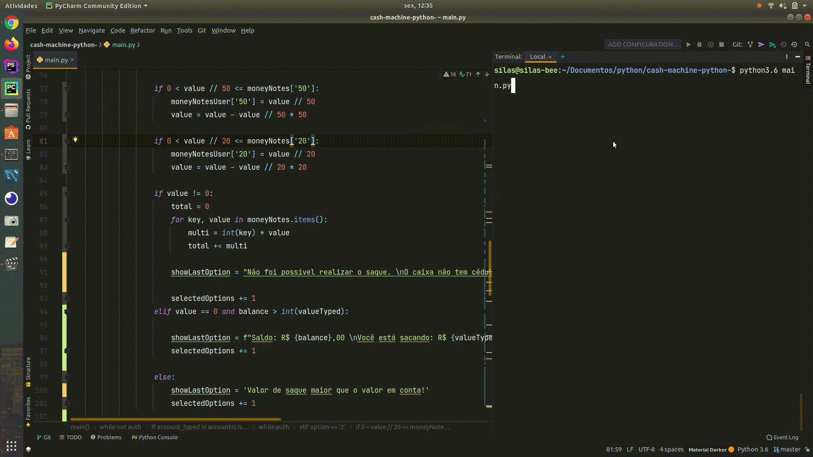

<h1 align="center">Caixa Eletrônico - Python</h1>

## 💻 Projeto

Script feito com Python, através da plataforma School of Net.

Para rodar o projeto normalmente, a versão do Python tem que ser igual ou mais recente que a versão 3.6

  

## 👨🏼‍💻 Desenvolvedor

- [Linkedin](https://www.linkedin.com/in/silas-pereira/)
- [Github](https://github.com/silas-junior)